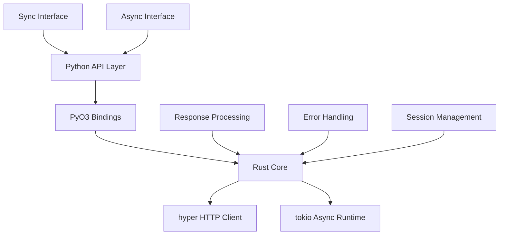

# Design Document

## Overview

The requestx library is a high-performance HTTP client for Python that leverages Rust's speed and memory safety while maintaining full compatibility with the popular `requests` API. The library uses PyO3 to create Python bindings for Rust HTTP functionality, providing both synchronous and asynchronous request capabilities with superior performance characteristics.

## Architecture

### Core Components



### Technology Stack

- **Python Bindings**: PyO3 for seamless Rust-Python integration
- **HTTP Client**: hyper for high-performance HTTP functionality in Rust
- **Async Runtime**: tokio for asynchronous operations
- **Async Integration**: pyo3-asyncio for native Python asyncio support
- **TLS Support**: hyper-tls for HTTPS connections
- **Build System**: maturin for building and packaging Python extensions
- **Dependency Management**: uv for Python, Cargo for Rust

## Components and Interfaces

### 1. Python API Layer (`requestx/__init__.py`)

**Purpose**: Provides the familiar requests-compatible interface

**Key Functions**:
- `get(url, **kwargs)` - HTTP GET requests
- `post(url, data=None, json=None, **kwargs)` - HTTP POST requests  
- `put(url, data=None, **kwargs)` - HTTP PUT requests
- `delete(url, **kwargs)` - HTTP DELETE requests
- `head(url, **kwargs)` - HTTP HEAD requests
- `options(url, **kwargs)` - HTTP OPTIONS requests
- `patch(url, data=None, **kwargs)` - HTTP PATCH requests
- `request(method, url, **kwargs)` - Generic request method

**Async Support**:
- All HTTP methods (`get`, `post`, `put`, `delete`, `head`, `options`, `patch`) support both sync and async usage
- When called with `await`, functions return coroutines for async execution
- Same function names work in both sync and async contexts

### 2. PyO3 Bindings Layer (`src/lib.rs`)

**Purpose**: Bridges Python and Rust, handles GIL management

**Key Components**:
```rust
#[pymodule]
fn requestx(py: Python, m: &PyModule) -> PyResult<()> {
    // Register HTTP method functions (support both sync and async)
    m.add_function(wrap_pyfunction!(get, m)?)?;
    m.add_function(wrap_pyfunction!(post, m)?)?;
    m.add_function(wrap_pyfunction!(put, m)?)?;
    m.add_function(wrap_pyfunction!(delete, m)?)?;
    m.add_function(wrap_pyfunction!(head, m)?)?;
    m.add_function(wrap_pyfunction!(options, m)?)?;
    m.add_function(wrap_pyfunction!(patch, m)?)?;
    m.add_function(wrap_pyfunction!(request, m)?)?;
    
    // Register classes
    m.add_class::<Response>()?;
    m.add_class::<Session>()?;
    
    Ok(())
}
```

**Function Signatures**:
```rust
#[pyfunction]
fn get(py: Python, url: String, kwargs: Option<&PyDict>) -> PyResult<PyObject> {
    // Detects if called in async context and returns appropriate type:
    // - Sync context: Returns Response object directly
    // - Async context: Returns coroutine that resolves to Response
}

// Alternative approach using separate internal implementations
#[pyfunction]
fn get(py: Python, url: String, kwargs: Option<&PyDict>) -> PyResult<Bound<'_, PyAny>> {
    // Check if we're in an async context
    if is_async_context(py)? {
        // Return a coroutine
        let coro = py.import("asyncio")?.call_method1("create_task", 
            (pyo3_asyncio::tokio::future_into_py(py, async move {
                get_impl_async(url, kwargs).await
            })?,))?;
        Ok(coro)
    } else {
        // Return response directly
        Ok(get_impl_sync(py, url, kwargs)?.into_any())
    }
}

// Example of async-aware function implementation
async fn get_async(url: String, config: RequestConfig) -> Result<ResponseData, RequestxError> {
    // Async implementation using hyper
}
```

### 3. Rust Core Layer (`src/core/`)

**Purpose**: Implements HTTP logic using hyper

**Modules**:
- `client.rs` - HTTP client implementation with sync/async detection
- `response.rs` - Response handling and processing
- `session.rs` - Session management
- `error.rs` - Error handling and conversion
- `runtime.rs` - Async runtime management and context detection

**Key Structures**:
```rust
pub struct RequestxClient {
    client: hyper::Client<hyper_tls::HttpsConnector<hyper::client::HttpConnector>>,
    runtime: Option<tokio::runtime::Runtime>,
}

pub struct RequestxResponse {
    inner: hyper::Response<hyper::Body>,
    body: Option<bytes::Bytes>,
}

pub struct RequestxSession {
    client: hyper::Client<hyper_tls::HttpsConnector<hyper::client::HttpConnector>>,
    cookies: cookie_store::CookieStore,
    headers: hyper::HeaderMap,
}
```

### 4. Response Object (`src/response.rs`)

**Purpose**: Provides requests-compatible response interface

**PyO3 Class**:
```rust
#[pyclass]
pub struct Response {
    status_code: u16,
    headers: HashMap<String, String>,
    text: Option<String>,
    content: Option<Vec<u8>>,
    url: String,
    encoding: Option<String>,
}

#[pymethods]
impl Response {
    #[getter]
    fn status_code(&self) -> u16 { self.status_code }
    
    #[getter] 
    fn text(&self) -> PyResult<String> { /* implementation */ }
    
    #[getter]
    fn content(&self) -> PyResult<Vec<u8>> { /* implementation */ }
    
    fn json(&self) -> PyResult<PyObject> { /* implementation */ }
    
    fn raise_for_status(&self) -> PyResult<()> { /* implementation */ }
}
```

### 5. Session Management (`src/session.rs`)

**Purpose**: Persistent HTTP sessions with cookie and header management

**Implementation**:
```rust
#[pyclass]
pub struct Session {
    client: hyper::Client<hyper_tls::HttpsConnector<hyper::client::HttpConnector>>,
    cookies: Arc<Mutex<cookie_store::CookieStore>>,
    headers: Arc<Mutex<hyper::HeaderMap>>,
}

#[pymethods]
impl Session {
    #[new]
    fn new() -> Self { /* implementation */ }
    
    fn get(&self, py: Python, url: String, kwargs: Option<&PyDict>) -> PyResult<Py<Response>> {
        /* implementation */
    }
    
    fn post(&self, py: Python, url: String, kwargs: Option<&PyDict>) -> PyResult<Py<Response>> {
        /* implementation */
    }
}
```

## Data Models

### Request Configuration

```rust
pub struct RequestConfig {
    pub method: String,
    pub url: String,
    pub headers: Option<HashMap<String, String>>,
    pub params: Option<HashMap<String, String>>,
    pub data: Option<RequestData>,
    pub json: Option<serde_json::Value>,
    pub timeout: Option<Duration>,
    pub allow_redirects: bool,
    pub verify: bool,
    pub cert: Option<String>,
    pub proxies: Option<HashMap<String, String>>,
    pub stream: bool,
    pub auth: Option<(String, String)>,
}

pub enum RequestData {
    Text(String),
    Bytes(Vec<u8>),
    Form(HashMap<String, String>),
    Multipart(Vec<MultipartField>),
}
```

### Response Data

```rust
pub struct ResponseData {
    pub status_code: u16,
    pub headers: hyper::HeaderMap,
    pub body: bytes::Bytes,
    pub url: hyper::Uri,
    pub history: Vec<hyper::Response<hyper::Body>>,
    pub elapsed: Duration,
}
```

## Error Handling

### Error Conversion Strategy

```rust
// Custom error types that map to Python exceptions
#[derive(Debug)]
pub enum RequestxError {
    NetworkError(hyper::Error),
    TimeoutError(tokio::time::error::Elapsed),
    HttpError { status: u16, message: String },
    JsonDecodeError(serde_json::Error),
    InvalidUrl(hyper::http::uri::InvalidUri),
    SslError(String),
}

// Convert Rust errors to Python exceptions
impl From<RequestxError> for PyErr {
    fn from(error: RequestxError) -> Self {
        match error {
            RequestxError::NetworkError(e) => {
                PyConnectionError::new_err(format!("Network error: {}", e))
            }
            RequestxError::TimeoutError(e) => {
                PyTimeoutError::new_err(format!("Request timeout: {}", e))
            }
            RequestxError::HttpError { status, message } => {
                PyHttpError::new_err(format!("HTTP {}: {}", status, message))
            }
            RequestxError::JsonDecodeError(e) => {
                PyJsonDecodeError::new_err(format!("JSON decode error: {}", e))
            }
            RequestxError::InvalidUrl(url) => {
                PyInvalidUrl::new_err(format!("Invalid URL: {}", url))
            }
            RequestxError::SslError(msg) => {
                PySslError::new_err(format!("SSL error: {}", msg))
            }
        }
    }
}
```

### Exception Hierarchy

```python
# Python exception classes that mirror requests
class RequestException(Exception):
    """Base exception for requestx"""
    pass

class ConnectionError(RequestException):
    """Network connection error"""
    pass

class HTTPError(RequestException):
    """HTTP error response"""
    pass

class Timeout(RequestException):
    """Request timeout"""
    pass

class JSONDecodeError(RequestException):
    """JSON decoding error"""
    pass
```

## Testing Strategy

### Unit Testing

**Python Tests** (`tests/test_*.py`):
- API compatibility tests against requests
- Response object behavior validation
- Error handling verification
- Session functionality testing
- Async operation testing

**Rust Tests** (`src/*/tests.rs`):
- Core HTTP functionality
- Error conversion logic
- Performance benchmarks
- Memory safety validation

### Integration Testing

**HTTP Server Testing**:
- Use httpbin.org for live HTTP testing
- Mock server for controlled scenarios
- SSL/TLS certificate testing
- Proxy server testing

**Compatibility Testing**:
- Drop-in replacement validation
- requests test suite adaptation
- Real-world API integration tests

### Performance Testing

**Benchmarking Framework**:
```python
# Performance comparison suite
import time
import asyncio
import psutil
import threading
from concurrent.futures import ThreadPoolExecutor
import requests
import httpx
import aiohttp
import requestx

class PerformanceMetrics:
    def __init__(self):
        self.requests_per_second = 0
        self.average_response_time = 0
        self.connection_time = 0
        self.cpu_usage = 0
        self.memory_usage = 0

def benchmark_sync_libraries():
    """Compare sync performance: requests vs httpx vs requestx"""
    urls = ["https://httpbin.org/get"] * 1000
    
    def measure_library(library_func, name):
        # Monitor CPU and memory
        process = psutil.Process()
        cpu_before = process.cpu_percent()
        memory_before = process.memory_info().rss
        
        start_time = time.time()
        response_times = []
        
        for url in urls:
            req_start = time.time()
            response = library_func(url)
            req_end = time.time()
            response_times.append(req_end - req_start)
        
        total_time = time.time() - start_time
        cpu_after = process.cpu_percent()
        memory_after = process.memory_info().rss
        
        metrics = PerformanceMetrics()
        metrics.requests_per_second = len(urls) / total_time
        metrics.average_response_time = sum(response_times) / len(response_times)
        metrics.cpu_usage = cpu_after - cpu_before
        metrics.memory_usage = memory_after - memory_before
        
        return metrics
    
    # Test each library
    requests_metrics = measure_library(requests.get, "requests")
    httpx_metrics = measure_library(httpx.get, "httpx")
    requestx_metrics = measure_library(requestx.get, "requestx")
    
    return {
        "requests": requests_metrics,
        "httpx": httpx_metrics, 
        "requestx": requestx_metrics
    }

async def benchmark_async_libraries():
    """Compare async performance: aiohttp vs httpx vs requestx"""
    urls = ["https://httpbin.org/get"] * 1000
    
    async def measure_async_library(session_func, request_func, name):
        process = psutil.Process()
        cpu_before = process.cpu_percent()
        memory_before = process.memory_info().rss
        
        start_time = time.time()
        
        async with session_func() as session:
            tasks = [request_func(session, url) for url in urls]
            await asyncio.gather(*tasks)
        
        total_time = time.time() - start_time
        cpu_after = process.cpu_percent()
        memory_after = process.memory_info().rss
        
        metrics = PerformanceMetrics()
        metrics.requests_per_second = len(urls) / total_time
        metrics.cpu_usage = cpu_after - cpu_before
        metrics.memory_usage = memory_after - memory_before
        
        return metrics
    
    # Test async libraries
    async def aiohttp_request(session, url):
        async with session.get(url) as response:
            return await response.text()
    
    async def httpx_request(session, url):
        response = await session.get(url)
        return response.text
    
    async def requestx_request(session, url):
        return await requestx.get(url)  # Same function, used with await
    
    aiohttp_metrics = await measure_async_library(
        aiohttp.ClientSession, aiohttp_request, "aiohttp"
    )
    httpx_metrics = await measure_async_library(
        lambda: httpx.AsyncClient(), httpx_request, "httpx"
    )
    requestx_metrics = await measure_async_library(
        lambda: None, requestx_request, "requestx"
    )
    
    return {
        "aiohttp": aiohttp_metrics,
        "httpx": httpx_metrics,
        "requestx": requestx_metrics
    }

def benchmark_connection_times():
    """Measure connection establishment times"""
    import socket
    
    def measure_connection_time(host, port):
        start = time.time()
        sock = socket.socket(socket.AF_INET, socket.SOCK_STREAM)
        try:
            sock.connect((host, port))
            connection_time = time.time() - start
            sock.close()
            return connection_time
        except Exception:
            return None
    
    # Test connection times to various endpoints
    endpoints = [
        ("httpbin.org", 443),
        ("jsonplaceholder.typicode.com", 443),
        ("api.github.com", 443)
    ]
    
    connection_times = {}
    for host, port in endpoints:
        times = []
        for _ in range(10):
            conn_time = measure_connection_time(host, port)
            if conn_time:
                times.append(conn_time)
        
        if times:
            connection_times[host] = {
                "average": sum(times) / len(times),
                "min": min(times),
                "max": max(times)
            }
    
    return connection_times
```

**Memory Profiling**:
- Memory usage tracking during large file downloads
- Concurrent request memory efficiency
- Memory leak detection in long-running processes

### Build and Packaging Testing

**Cross-Platform Builds**:
- Windows (x86_64, ARM64)
- macOS (x86_64, ARM64) 
- Linux (x86_64, ARM64, musl)

**Python Version Compatibility**:
- Python 3.8, 3.9, 3.10, 3.11, 3.12
- PyPy compatibility testing

## Implementation Considerations

### Async/Await Integration

The library provides seamless async/await support using Python's native asyncio integration:

```rust
use pyo3_asyncio::tokio::future_into_py;

#[pyfunction]
fn get(py: Python, url: String, kwargs: Option<&PyDict>) -> PyResult<PyObject> {
    let config = parse_kwargs(kwargs)?;
    
    // Check if we're in an async context
    if pyo3_asyncio::tokio::get_running_loop(py).is_ok() {
        // Return coroutine for async usage
        let future = async move {
            let response = get_async(url, config).await?;
            Ok(Response::from_response_data(response))
        };
        future_into_py(py, future)
    } else {
        // Execute synchronously
        let rt = tokio::runtime::Runtime::new()?;
        let response = rt.block_on(get_async(url, config))?;
        Ok(Response::from_response_data(response).into_py(py))
    }
}

// Core async implementation
async fn get_async(url: String, config: RequestConfig) -> Result<ResponseData, RequestxError> {
    let client = hyper::Client::builder()
        .build(hyper_tls::HttpsConnector::new());
    
    let uri: hyper::Uri = url.parse()?;
    let req = hyper::Request::builder()
        .method(hyper::Method::GET)
        .uri(uri)
        .body(hyper::Body::empty())?;
    
    let response = client.request(req).await?;
    
    // Process response...
    Ok(ResponseData {
        status_code: response.status().as_u16(),
        // ... other fields
    })
}
```

**Usage Examples**:
```python
import requestx
import asyncio

# Synchronous usage
response = requestx.get("https://httpbin.org/get")
print(response.status_code)

# Asynchronous usage - same function!
async def main():
    response = await requestx.get("https://httpbin.org/get")
    print(response.status_code)

asyncio.run(main())
```

### Memory Management

- Use `Py<T>` for objects that need to outlive GIL scope
- Use `Bound<'py, T>` for most API interactions
- Implement proper `__traverse__` and `__clear__` for GC integration
- Stream large responses to avoid memory spikes

### Performance Optimizations

- Connection pooling through hyper::Client reuse
- HTTP/2 support for multiplexing
- Compression handling (gzip, deflate, brotli)
- DNS caching and connection keep-alive
- Zero-copy operations where possible

### Security Considerations

- Certificate validation by default
- Secure cookie handling
- Proxy authentication support
- TLS configuration options
- Input validation and sanitization

This design provides a solid foundation for building a high-performance, requests-compatible HTTP client that leverages Rust's performance advantages while maintaining Python's ease of use.