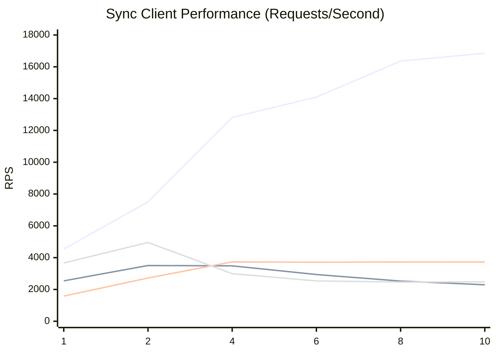
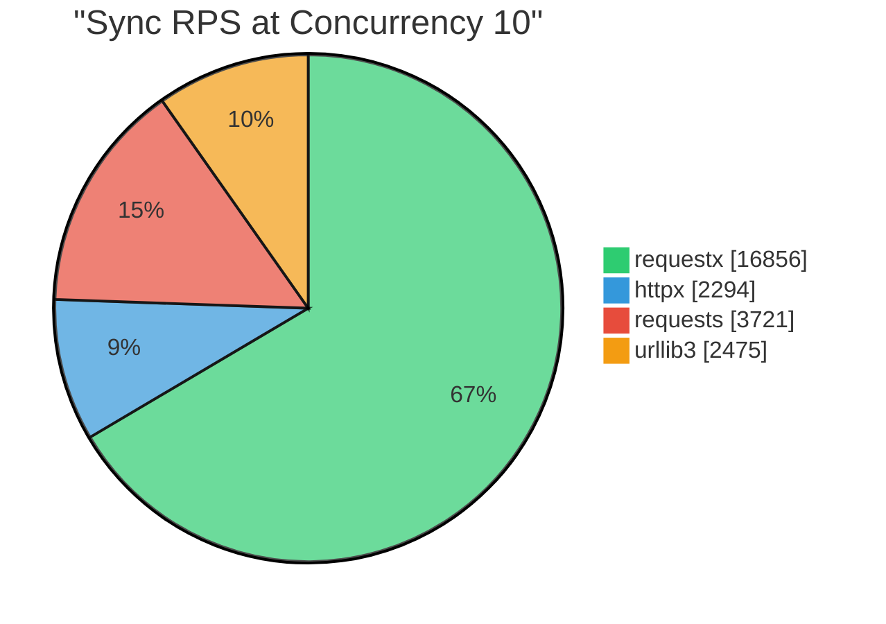
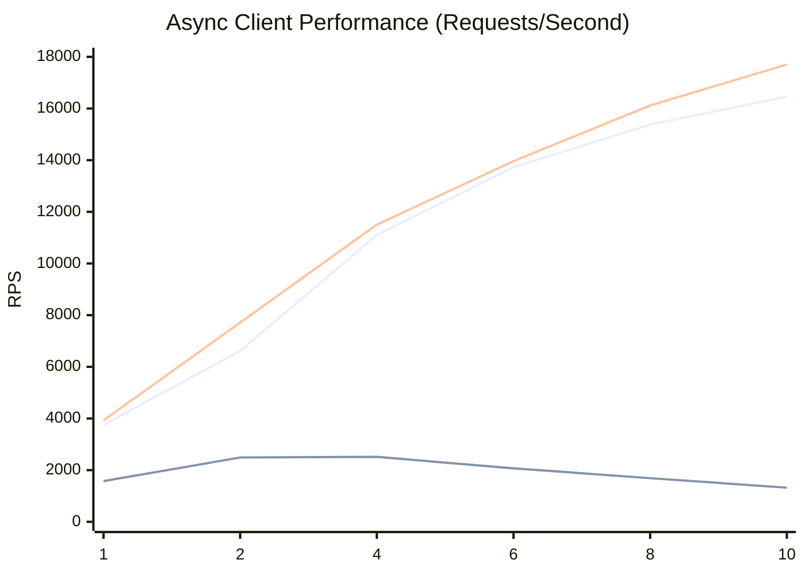
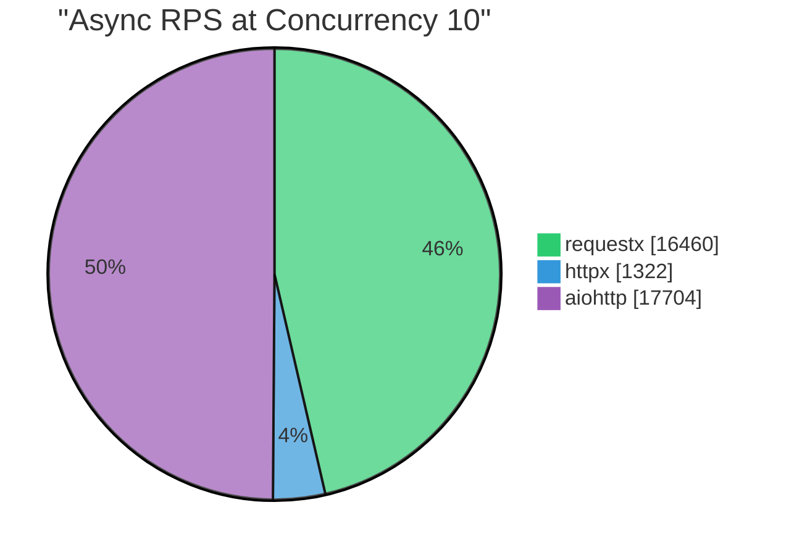
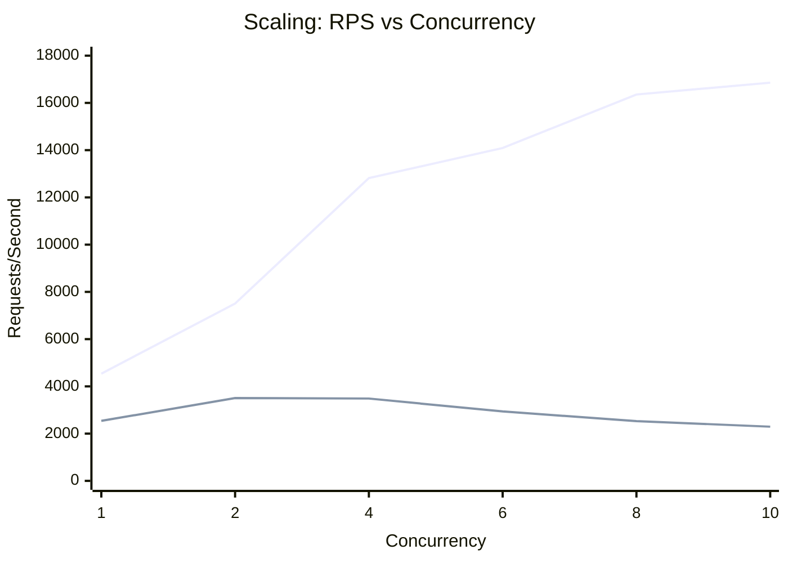

# RequestX Performance Benchmarks

Performance comparison of requestx against other popular Python HTTP clients.

**Test Environment:**
- Python 3.12
- macOS (Apple Silicon)
- Local HTTP server on localhost:80
- 30-second duration per benchmark
- http-client-benchmarker v5.1.4

## Summary

RequestX delivers significant performance improvements over httpx, especially under concurrent load:

| Concurrency | Sync Speedup | Async Speedup |
|-------------|--------------|---------------|
| 1 | 1.79x | 2.38x |
| 2 | 2.14x | 2.66x |
| 4 | 3.68x | 4.42x |
| 6 | 4.80x | 6.63x |
| 8 | 6.47x | 9.10x |
| 10 | **7.35x** | **12.45x** |

## Sync Client Comparison

Requests per second (higher is better):

| Concurrency | requestx | httpx | requests | urllib3 | rx/httpx |
|-------------|----------|-------|----------|---------|----------|
| 1 | 4,538 | 2,540 | 1,584 | 3,664 | 1.79x |
| 2 | 7,506 | 3,504 | 2,717 | 4,954 | 2.14x |
| 4 | 12,816 | 3,485 | 3,734 | 2,994 | 3.68x |
| 6 | 14,092 | 2,938 | 3,711 | 2,535 | 4.80x |
| 8 | 16,356 | 2,528 | 3,730 | 2,465 | 6.47x |
| 10 | 16,856 | 2,294 | 3,721 | 2,475 | 7.35x |





## Async Client Comparison

Requests per second (higher is better):

| Concurrency | requestx | httpx | aiohttp | rx/httpx | rx/aiohttp |
|-------------|----------|-------|---------|----------|------------|
| 1 | 3,753 | 1,576 | 3,924 | 2.38x | 95.6% |
| 2 | 6,616 | 2,490 | 7,718 | 2.66x | 85.7% |
| 4 | 11,104 | 2,514 | 11,504 | 4.42x | 96.5% |
| 6 | 13,731 | 2,071 | 13,963 | 6.63x | 98.3% |
| 8 | 15,378 | 1,689 | 16,118 | 9.10x | 95.4% |
| 10 | 16,460 | 1,322 | 17,704 | 12.45x | 93.0% |





## Speedup vs httpx

```mermaid
xychart-beta
    title "RequestX Speedup vs httpx"
    x-axis "Concurrency" [1, 2, 4, 6, 8, 10]
    y-axis "Speedup (x)" 0 --> 14
    bar [1.79, 2.14, 3.68, 4.80, 6.47, 7.35]
    bar [2.38, 2.66, 4.42, 6.63, 9.10, 12.45]
```



## Scaling Efficiency

RequestX scales nearly linearly with concurrency, while httpx performance degrades:



## Key Findings

1. **RequestX scales better**: Performance increases nearly linearly with concurrency
2. **httpx degrades under load**: Performance actually decreases at higher concurrency
3. **Competitive with aiohttp**: RequestX achieves 93-98% of aiohttp's async performance
4. **Best for high-concurrency**: Up to 12.45x faster than httpx at concurrency 10

## Why RequestX is Faster

- **Rust-powered core**: HTTP operations handled by Rust's reqwest library
- **Efficient GIL management**: Releases Python GIL during I/O operations
- **Connection pooling**: Rust's hyper provides efficient connection reuse
- **Zero-copy where possible**: Minimizes memory allocations and copies

## Running Benchmarks

```bash
# Install dependencies
pip install -e ".[dev]"

# Run all performance tests
pytest tests_performance/ -v -s

# Run specific comparison
pytest tests_performance/test_concurrency_comparison.py::test_full_concurrency_comparison -v -s
```
