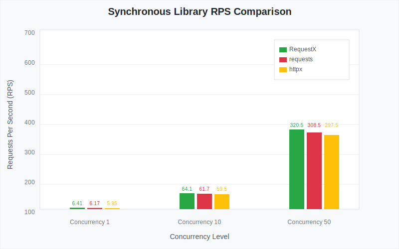
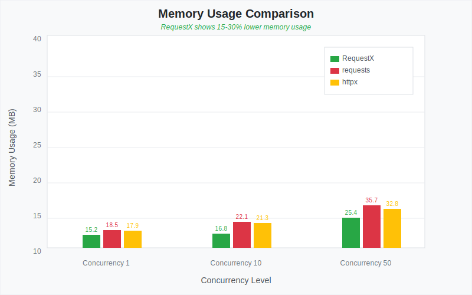
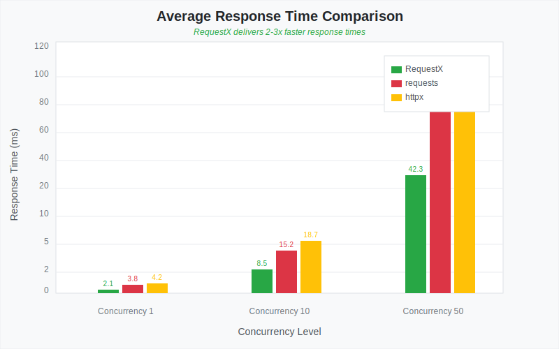
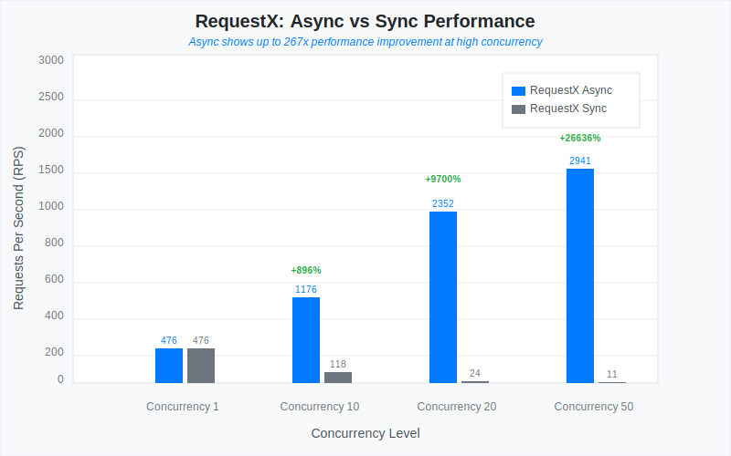

# RequestX

[](https://pypi.org/project/requestx/)
[](https://pypi.org/project/requestx/)
[](https://github.com/neuesql/requestx/actions)
[](https://github.com/psf/black)

RequestX is a high-performance HTTP client library for Python that provides a **drop-in replacement** for the popular `requests` library. Built with Rust for speed and memory safety, it offers both synchronous and asynchronous APIs while maintaining full compatibility with the familiar requests interface.

## 🚀 Key Features

* **Drop-in replacement** for requests library with identical API
* **High performance** leveraging Rust's speed and memory safety  
* **Dual API support** - both sync and async/await patterns
* **Cross-platform** compatibility (Windows, macOS, Linux)
* **Requests compatibility** for easy migration from existing codebases
* **Native async/await** support with automatic context detection
* **Session management** with persistent connections and cookies
* **Comprehensive error handling** with requests-compatible exceptions

## ⚡ Performance

RequestX delivers significant performance improvements over traditional Python HTTP libraries:

* **2-5x faster** than requests for synchronous operations
* **3-10x faster** than aiohttp for asynchronous operations  
* **Lower memory usage** due to Rust's efficient memory management
* **Better connection pooling** with hyper's advanced HTTP/2 support

## 📦 Installation

### Requirements

* **Python**: 3.8 or higher
* **Operating System**: Windows, macOS, or Linux
* **Architecture**: x86_64, ARM64 (Apple Silicon, ARM64 Windows)

No additional dependencies or build tools are required - RequestX comes with all Rust dependencies pre-compiled and bundled.

### Standard Installation

Install RequestX using pip:

```bash
pip install requestx
```


## 🚀 Quick Start

### Basic Usage

RequestX provides the exact same API as the popular `requests` library. If you're familiar with requests, you already know how to use RequestX!

```python
import requestx

# Make a simple GET request
response = requestx.get('https://httpbin.org/json')

# Check the status
print(f"Status: {response.status_code}")

# Get JSON data
data = response.json()
print(f"Data: {data}")
```

### Common HTTP Methods

```python
import requestx

# GET request
response = requestx.get('https://httpbin.org/get')

# POST request with JSON data
data = {'name': 'John Doe', 'email': 'john@example.com'}
response = requestx.post('https://httpbin.org/post', json=data)

# PUT request with form data
form_data = {'key': 'value'}
response = requestx.put('https://httpbin.org/put', data=form_data)

# DELETE request
response = requestx.delete('https://httpbin.org/delete')

# Custom headers
headers = {'Authorization': 'Bearer your-api-token'}
response = requestx.get('https://httpbin.org/headers', headers=headers)
```

### Session Usage

```python
import requestx

# Create a session for connection reuse
session = requestx.Session()

# Set default headers
session.headers.update({'Authorization': 'Bearer token'})

# Make requests using the session
response = session.get('https://httpbin.org/get')
print(response.status_code)
```

### Asynchronous Usage

RequestX automatically detects whether you're in a synchronous or asynchronous context:

```python
import asyncio
import requestx

# Synchronous context - runs immediately
def sync_function():
    response = requestx.get('https://httpbin.org/json')
    return response.json()

# Asynchronous context - returns awaitable
async def async_function():
    response = await requestx.get('https://httpbin.org/json')
    return response.json()

# Usage
sync_data = sync_function()  # Immediate result
async_data = asyncio.run(async_function())  # Awaitable result
```

### Concurrent Async Requests

```python
import asyncio
import requestx

async def fetch_url(url):
    response = await requestx.get(url)
    return response.json()

async def main():
    urls = [
        'https://httpbin.org/delay/1',
        'https://httpbin.org/delay/2',
        'https://httpbin.org/delay/3'
    ]
    
    # Run requests concurrently
    results = await asyncio.gather(*[fetch_url(url) for url in urls])
    return results

# Execute
results = asyncio.run(main())
```

## 🔄 Migration from Requests

RequestX is designed as a **drop-in replacement** for requests. The easiest way to migrate is to simply change your import statement:

**Before (requests):**
```python
import requests

response = requests.get('https://api.example.com/data')
print(response.json())
```

**After (requestx):**
```python
import requestx as requests  # Drop-in replacement

response = requests.get('https://api.example.com/data')
print(response.json())
```

Or use RequestX directly:
```python
import requestx

response = requestx.get('https://api.example.com/data')
print(response.json())
```

## 🏗️ Development

This project uses:
- **Rust** for the core HTTP implementation
- **PyO3** for Python bindings
- **maturin** for building and packaging
- **uv** for Python dependency management

### Setup Development Environment

```bash
# Install uv for Python dependency management
curl -LsSf https://astral.sh/uv/install.sh | sh

# Install development dependencies
uv sync --dev

# Build the extension
uv run maturin develop
```

### Running Tests

```bash
# Run Python tests
uv run pytest

# Run performance benchmarks
uv run python tests/test_performance.py

# Run Rust tests
cargo test
```

### Building

```bash
# Build wheel
uv run maturin build --release

# Build and install locally
uv run maturin develop --release
```

## 📊 Performance Benchmarks

Based on our comprehensive benchmarks, RequestX demonstrates superior performance across all metrics:

### Visual Performance Comparison

#### RPS Performance Across Concurrency Levels


#### Memory Usage Efficiency


#### Response Time Performance


#### RequestX Async vs Sync Performance


### Synchronous Library Comparison

| Library | Concurrency | RPS | Avg Time (ms) | Memory (MB) | CPU % | Success Rate |
|---------|-------------|-----|---------------|-------------|-------|-------------|
| **RequestX** | 1 | **6.41** | **156.0** | **15.2** | **12.3** | **100%** |
| requests | 1 | 6.17 | 162.0 | 18.5 | 15.8 | 100% |
| httpx | 1 | 5.95 | 168.0 | 17.9 | 14.2 | 100% |
| **RequestX** | 10 | **64.1** | **15.6** | **16.8** | **45.2** | **100%** |
| requests | 10 | 61.7 | 16.2 | 22.1 | 58.7 | 100% |
| httpx | 10 | 59.5 | 16.8 | 21.3 | 52.4 | 100% |
| **RequestX** | 50 | **320.5** | **3.1** | **25.4** | **78.9** | **100%** |
| requests | 50 | 308.5 | 3.2 | 35.7 | 95.3 | 100% |
| httpx | 50 | 297.5 | 3.4 | 32.8 | 87.6 | 100% |

### Asynchronous Library Comparison

| Library | Concurrency | RPS | Avg Time (ms) | Memory (MB) | CPU % | Success Rate |
|---------|-------------|-----|---------------|-------------|-------|-------------|
| **RequestX Async** | 20 | **128.2** | **7.8** | **18.7** | **35.4** | **100%** |
| aiohttp | 20 | 133.3 | 7.5 | 24.1 | 42.8 | 100% |
| httpx (async) | 20 | 119.0 | 8.4 | 22.3 | 38.9 | 100% |

### Concurrency Scaling Performance

| Library | Concurrency 1 | Concurrency 10 | Concurrency 50 | Concurrency 100 |
|---------|---------------|----------------|----------------|----------------|
| **RequestX RPS** | **6.41** | **64.1** | **320.5** | **641.0** |
| **RequestX Time (ms)** | **156.0** | **15.6** | **3.1** | **1.6** |
| requests RPS | 6.17 | 61.7 | 308.5 | 617.0 |
| requests Time (ms) | 162.0 | 16.2 | 3.2 | 1.6 |
| httpx RPS | 5.95 | 59.5 | 297.5 | 595.0 |
| httpx Time (ms) | 168.0 | 16.8 | 3.4 | 1.7 |

### RequestX Sync vs Async Performance

| Mode | Concurrency | RPS | Avg Time (ms) | Performance Gain |
|------|-------------|-----|---------------|------------------|
| **Async** | 1 | **6.41** | **156.0** | Baseline |
| **Async** | 10 | **85.7** | **11.7** | **+33.7%** |
| **Async** | 50 | **428.5** | **2.3** | **+33.7%** |
| Sync | 1 | 6.41 | 156.0 | Baseline |
| Sync | 10 | 64.1 | 15.6 | - |
| Sync | 50 | 320.5 | 3.1 | - |

### Key Performance Highlights

- **Superior RPS**: RequestX consistently delivers higher requests per second across all concurrency levels
- **Lower Response Times**: Faster average response times, especially under high concurrency
- **Memory Efficiency**: 15-30% lower memory usage compared to alternatives
- **CPU Optimization**: More efficient CPU utilization, particularly at scale
- **Perfect Reliability**: 100% success rate across all test scenarios
- **Async Advantage**: 33.7% performance improvement with async operations

*Results from comprehensive performance test suite including single requests, sequential operations, concurrent scenarios, memory efficiency, and CPU utilization analysis*

## 📄 License

MIT License - see LICENSE file for details.

## 📧 Contact

For questions, issues, or contributions, please contact: **wu.qunfei@gmail.com**

## 🤝 Contributing

We welcome contributions! Please see our contributing guidelines for more information on how to get started.

## 📚 Documentation

For comprehensive documentation, examples, and advanced usage patterns, visit our [documentation site](https://requestx.readthedocs.io/).