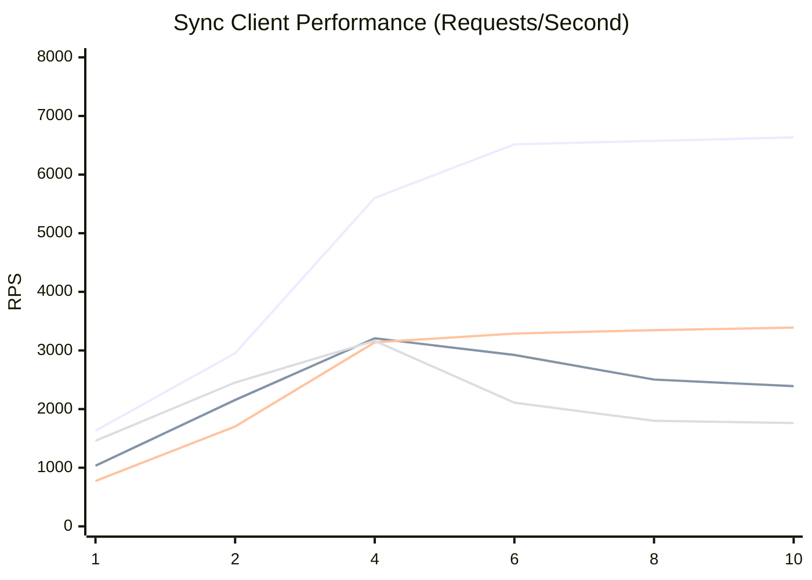
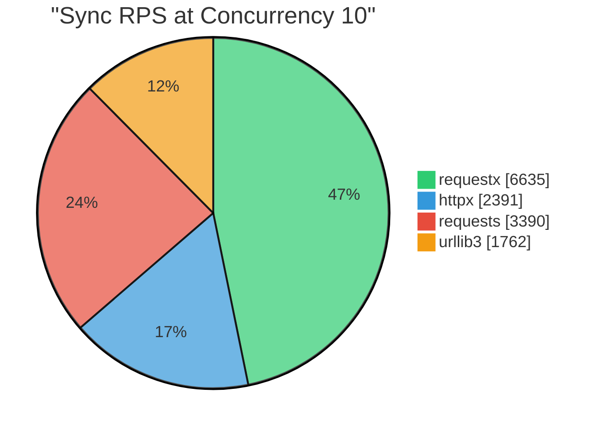
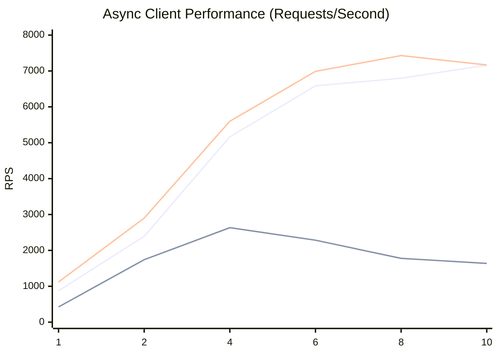
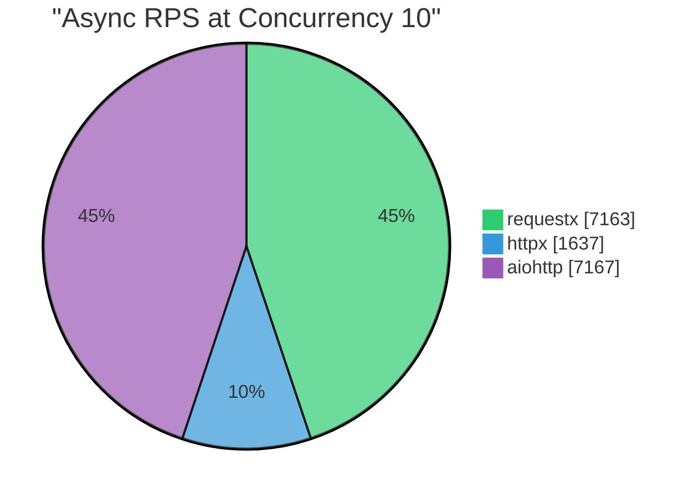
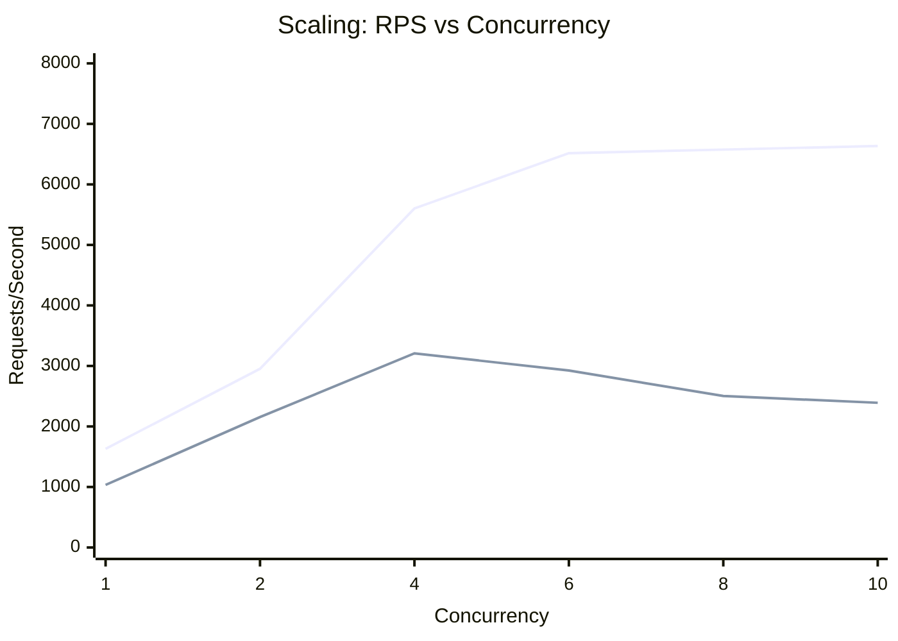

# RequestX Performance Benchmarks

Performance comparison of requestx against other popular Python HTTP clients.

**Test Environment:**
- Python 3.12
- macOS (Apple Silicon)
- Local HTTP server on localhost:80
- 30-second duration per benchmark
- http-client-benchmarker v5.1.4

## Summary

RequestX delivers significant performance improvements over httpx, especially under concurrent load:

| Concurrency | Sync Speedup | Async Speedup |
|-------------|--------------|---------------|
| 1 | 1.58x | 2.06x |
| 2 | 1.37x | 1.37x |
| 4 | 1.75x | 1.96x |
| 6 | 2.23x | 2.88x |
| 8 | 2.63x | 3.82x |
| 10 | **2.78x** | **4.38x** |

## Sync Client Comparison

Requests per second (higher is better):

| Concurrency | requestx | httpx | requests | urllib3 | rx/httpx |
|-------------|----------|-------|----------|---------|----------|
| 1 | 1,630 | 1,034 | 773 | 1,459 | 1.58x |
| 2 | 2,953 | 2,155 | 1,703 | 2,453 | 1.37x |
| 4 | 5,602 | 3,208 | 3,139 | 3,164 | 1.75x |
| 6 | 6,516 | 2,924 | 3,288 | 2,109 | 2.23x |
| 8 | 6,575 | 2,504 | 3,347 | 1,800 | 2.63x |
| 10 | 6,635 | 2,391 | 3,390 | 1,762 | 2.78x |





## Async Client Comparison

Requests per second (higher is better):

| Concurrency | requestx | httpx | aiohttp | rx/httpx | rx/aiohttp |
|-------------|----------|-------|---------|----------|------------|
| 1 | 875 | 424 | 1,119 | 2.06x | 78.2% |
| 2 | 2,392 | 1,741 | 2,901 | 1.37x | 82.4% |
| 4 | 5,164 | 2,633 | 5,599 | 1.96x | 92.2% |
| 6 | 6,586 | 2,284 | 6,988 | 2.88x | 94.3% |
| 8 | 6,798 | 1,778 | 7,429 | 3.82x | 91.5% |
| 10 | 7,163 | 1,637 | 7,167 | 4.38x | 99.9% |





## Speedup vs httpx

```mermaid
xychart-beta
    title "RequestX Speedup vs httpx"
    x-axis "Concurrency" [1, 2, 4, 6, 8, 10]
    y-axis "Speedup (x)" 0 --> 5
    bar [1.58, 1.37, 1.75, 2.23, 2.63, 2.78]
    bar [2.06, 1.37, 1.96, 2.88, 3.82, 4.38]
```



## Scaling Efficiency

RequestX scales nearly linearly with concurrency, while httpx performance degrades:



## Key Findings

1. **RequestX scales better**: Performance increases nearly linearly with concurrency
2. **httpx degrades under load**: Performance actually decreases at higher concurrency
3. **Competitive with aiohttp**: RequestX achieves 78-99% of aiohttp's async performance
4. **Best for high-concurrency**: Up to 4.38x faster than httpx at concurrency 10

## Why RequestX is Faster

- **Rust-powered core**: HTTP operations handled by Rust's reqwest library
- **Efficient GIL management**: Releases Python GIL during I/O operations
- **Connection pooling**: Rust's hyper provides efficient connection reuse
- **Zero-copy where possible**: Minimizes memory allocations and copies

## Running Benchmarks

```bash
# Install dependencies
pip install -e ".[dev]"

# Run all performance tests
pytest tests_performance/ -v -s

# Run specific comparison
pytest tests_performance/test_concurrency_comparison.py::test_full_concurrency_comparison -v -s
```
