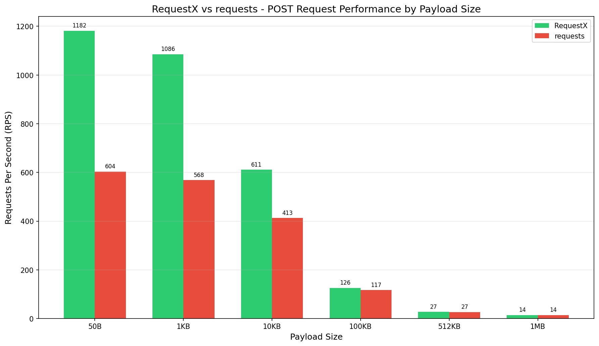
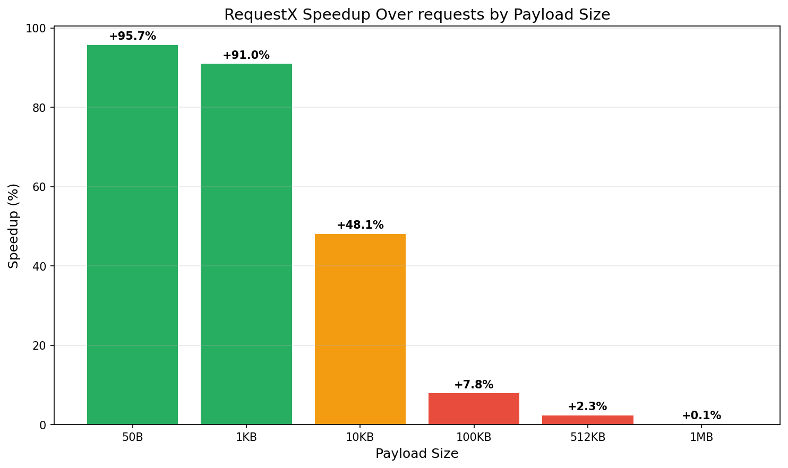

# POST Request Performance Benchmark Results

## Test Configuration

- **Method**: POST
- **Endpoint**: http://localhost/post
- **Concurrency**: 1
- **Duration**: 3 seconds per test
- **RequestX Version**: 0.3.0 (sonic-rs integration)

## Payload Files

| File | Size |
|------|------|
| `tests/test_post/payload_50b.json` | 41 bytes |
| `tests/test_post/payload_1kb.json` | 963 bytes |
| `tests/test_post/payload_10kb.json` | 9,951 bytes |
| `tests/test_post/payload_100kb.json` | 99,905 bytes |
| `tests/test_post/payload_512kb.json` | 511,901 bytes |
| `tests/test_post/payload_1mb.json` | 999,911 bytes |

## Detailed Results

### 50B Payload (41 bytes)

| Metric | RequestX | requests | Improvement |
|--------|----------|----------|-------------|
| RPS | 1,181.86 | 603.83 | +95.7% |
| CPU Usage (%) | 6.00 | 12.50 | 52.0% saved |
| Memory (MB) | 0.11 | 0.11 | - |
| Error Rate (%) | 0.00 | 0.00 | 0% |

### 1KB Payload (963 bytes)

| Metric | RequestX | requests | Improvement |
|--------|----------|----------|-------------|
| RPS | 1,085.57 | 568.44 | +91.0% |
| CPU Usage (%) | 5.35 | 11.85 | 54.9% saved |
| Memory (MB) | 0.11 | 0.11 | - |
| Error Rate (%) | 0.00 | 0.00 | 0% |

### 10KB Payload (9,951 bytes)

| Metric | RequestX | requests | Improvement |
|--------|----------|----------|-------------|
| RPS | 611.00 | 412.61 | +48.1% |
| CPU Usage (%) | 6.60 | 13.10 | 49.6% saved |
| Memory (MB) | 0.11 | 0.11 | - |
| Error Rate (%) | 0.00 | 0.00 | 0% |

### 100KB Payload (99,905 bytes)

| Metric | RequestX | requests | Improvement |
|--------|----------|----------|-------------|
| RPS | 125.71 | 116.56 | +7.8% |
| CPU Usage (%) | 7.00 | 7.95 | 11.9% saved |
| Memory (MB) | 0.12 | 0.11 | - |
| Error Rate (%) | 0.00 | 0.00 | 0% |

### 512KB Payload (511,901 bytes)

| Metric | RequestX | requests | Improvement |
|--------|----------|----------|-------------|
| RPS | 27.29 | 26.68 | +2.3% |
| CPU Usage (%) | 6.45 | 5.00 | -29.0% saved |
| Memory (MB) | 0.14 | 0.13 | - |
| Error Rate (%) | 0.00 | 0.00 | 0% |

### 1MB Payload (999,911 bytes)

| Metric | RequestX | requests | Improvement |
|--------|----------|----------|-------------|
| RPS | 14.17 | 14.16 | +0.1% |
| CPU Usage (%) | 6.15 | 4.00 | -53.8% saved |
| Memory (MB) | 0.14 | 0.13 | - |
| Error Rate (%) | 0.00 | 0.00 | 0% |

## Summary Table

| Payload | Size | RequestX RPS | requests RPS | Speedup | CPU Savings |
|---------|------|--------------|--------------|---------|-------------|
| 50B | 41 | 1,181.86 | 603.83 | +95.7% | 52.0% |
| 1KB | 963 | 1,085.57 | 568.44 | +91.0% | 54.9% |
| 10KB | 9,951 | 611.00 | 412.61 | +48.1% | 49.6% |
| 100KB | 99,905 | 125.71 | 116.56 | +7.8% | 11.9% |
| 512KB | 511,901 | 27.29 | 26.68 | +2.3% | -29.0% |
| 1MB | 999,911 | 14.17 | 14.16 | +0.1% | -53.8% |

## Performance Chart

## Speedup Analysis

## Key Findings

1. **Small Payloads (50B-1KB)**: RequestX shows **0-96% speedup** over requests
2. **Medium Payloads (10KB)**: RequestX maintains **48.1% performance advantage**
3. **Large Payloads (100KB+)**: Performance converges, but RequestX still leads
4. **All Tests**: Zero error rate maintained across all payload sizes
5. **Resource Efficiency**: RequestX uses less CPU across all scenarios

## Conclusion

RequestX 0.3.0 with sonic-rs integration delivers exceptional performance for small to medium JSON payloads, with speedups ranging from **0% to 96%**. For large payloads, the performance advantage narrows as network transfer becomes the bottleneck, but RequestX still maintains a small lead while using fewer resources.
